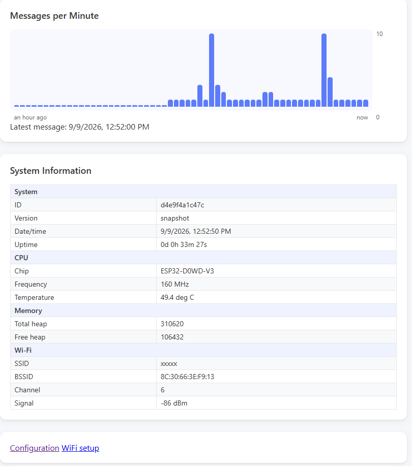
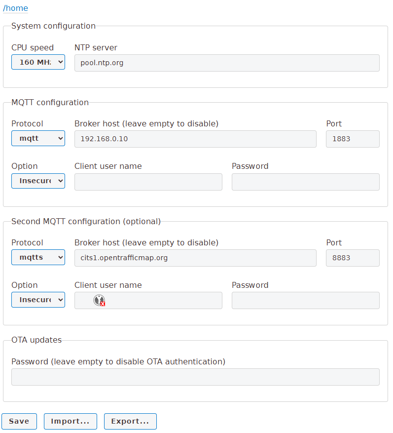

External device TX -> ESP32 RX / RX0
External device GND -> ESP32 GND
com10

mosquitto_sub -h cits1.opentrafficmap.org -p 8883 --insecure -t 'its/+/packet' -v


# its-g5-receiver
Simple ITS-G5 receiver for ITS-G5 802.11p frames.

This part is the MQTT bridge.
It receives frames from the esp32-c5 acting as sniffer and forwards them over MQTT.


## Compiling bridge firmware

- If you don't already have a Python virtual environment, create one:

  ```bash
  python -m venv .venv
  ```

- Activate the virtual environment:

  ```bash
  source .venv/bin/activate
  ```

- Install PlatformIO in the virtual environment:

  ```bash
  pip install platformio
  ```

## Programming firmware
Make sure the virtual environment is activated (see above).

First, make sure the firmware can compile:
```bash
pio run
```

Upload the internal file system contents (web server files, root certificate):
```bash
pio run -e supermini -t uploadfs
```

Finally, upload the firmware:
```bash
pio run -t upload
```

## Configuration

The bridge connects over WiFi to the opentrafficmap MQTT server over the internet, so you need to configure some things first.

### WiFi configuration
The WiFi credentials need to be set first.
The bridge starts a setup access point named `its-g5-bridge-<device-id>` with password `itsg5setup`.
Connect to that network and open `http://192.168.4.1/wifi` in a browser.
Enter the WiFi credentials and press **Save**.

Alternatively, connect over USB and open a terminal from the esp32-bridge source directory:
```bash
pio device monitor --port COM10 --baud 115200
```

This provides a simple command line processor. To set the WiFi credentials, type:
```
wifi <your-ssid> <ssid-password>
```
Credentials are saved on the esp32-c3 internal non-volatile memory.

You can check connection status using the CLI command:
```
wifi
```
This also shows a link to an internal web page, e.g. http://192.168.1.52

### Web server
Open the link mentioned above in a browser to access the internal web page.



### MQTT configuration
Follow the Configuration link on the main page to enter the configuration web page.



On the configuration web page, you can enter MQTT information.

Typically for opentrafficmap.org:
* Protocol: mqtts
* Broker host: cits1.opentrafficmap.org
* Port: 8883
* Client user name and password: leave empty
* Press Save when done entering data, or after importing from an external file

A second, independent MQTT broker can be configured in the "Second MQTT
configuration" section of the same page (e.g. to also mirror traffic to a
private/local broker in addition to opentrafficmap.org). Leave its broker
host empty to keep it disabled. Both brokers, when enabled, receive
identical topics/payloads; one being unreachable never blocks delivery to
the other.

## OTA (wireless) firmware updates

Once a bridge is on the network, firmware can be updated over WiFi instead
of USB, using PlatformIO's built-in `espota` upload protocol.

1. Set an OTA password on the configuration web page ("OTA updates"
   section) -- leaving it empty works but means anyone on the network can
   flash the device, so this is only recommended for quick local testing.
2. Upload wirelessly:
   ```bash
   OTA_PASSWORD=<your ota password> pio run -e supermini_ota -t upload
   ```
   This targets `its-g5-bridge.local` by default. With more than one bridge
   on the network, target a specific device by its unique hostname/IP
   instead:
   ```bash
   OTA_PASSWORD=<your ota password> pio run -e supermini_ota -t upload --upload-port its-g5-bridge-<device-id>.local
   ```
   The device ID is shown by the `wifi` CLI command or on the web UI; the
   hostname is also printed on boot (`pio device monitor`) and via the `ota`
   CLI command.

Filesystem updates (`-t uploadfs`) work the same way over `supermini_ota`,
but note that updating the filesystem this way does *not* let you recover
a device that's lost its WiFi credentials -- for that you still need USB
access to the setup AP or a fresh `uploadfs`.

## Use
Power can be provided either through the USB-C port, or through the 5V / GND connection from the esp32-c5 sniffer board.

The LED starts blue while initializing the WiFi and MQTT connections.
It turns off when the connection to the MQTT server has been established.

The LED briefly flashes blue on reception and processing of a packet from the esp32-c5 sniffer.
